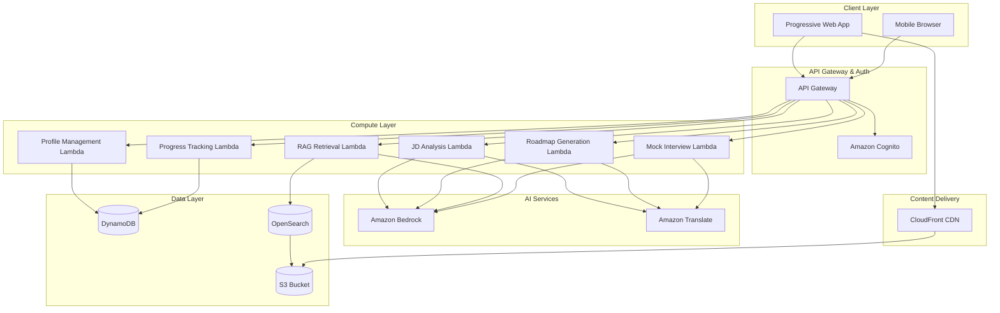
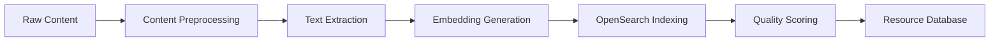

# Design Document

## Overview

CareerSetu is designed as a serverless, AI-powered platform leveraging AWS services to provide personalized career guidance for Indian engineering students. The system follows a modular, microservices architecture that can scale efficiently while maintaining cost-effectiveness for the target demographic.

The platform combines multiple AI capabilities: job description analysis using Amazon Bedrock, personalized roadmap generation, RAG-based resource curation, and multi-language support specifically optimized for Indian languages. The mobile-first design ensures accessibility across diverse connectivity conditions common in Tier-2 and Tier-3 cities.

## Architecture

### High-Level Architecture



### Component Architecture

The system is organized into six core components:

1. **User Management Component**: Handles authentication, profile management, and user preferences
2. **AI Analysis Component**: Processes job descriptions and identifies skill gaps using Bedrock
3. **Roadmap Generation Component**: Creates personalized learning paths with AI assistance
4. **RAG Resource Component**: Manages curated learning resources with intelligent retrieval
5. **Progress Tracking Component**: Monitors learning advancement and adapts plans
6. **Assessment Component**: Provides mock interviews and practice questions

## Components and Interfaces

### User Management Component

**Responsibilities:**
- Student profile creation and management
- Authentication and authorization
- Language preference handling
- User session management

**Key Interfaces:**
```typescript
interface StudentProfile {
  userId: string;
  engineeringBranch: string;
  currentSkills: string[];
  targetRole: 'SDE' | 'Data' | 'Cloud';
  dailyTimeAvailable: number; // minutes
  preferredLanguage: 'en' | 'hi' | 'ta' | 'te' | 'bn' | 'mr';
  createdAt: Date;
  updatedAt: Date;
}

interface UserPreferences {
  userId: string;
  notificationSettings: NotificationSettings;
  learningStyle: 'visual' | 'practical' | 'theoretical';
  difficultyPreference: 'beginner' | 'intermediate' | 'advanced';
}
```

**AWS Services Used:**
- Amazon Cognito for authentication
- DynamoDB for profile storage
- Lambda for profile management logic

### AI Analysis Component

**Responsibilities:**
- Job description parsing and skill extraction
- Skill gap analysis between student profile and job requirements
- Industry trend analysis for role-specific requirements

**Key Interfaces:**
```typescript
interface JobDescription {
  id: string;
  title: string;
  company: string;
  description: string;
  requiredSkills: Skill[];
  experienceLevel: string;
  location: string;
}

interface Skill {
  name: string;
  category: 'technical' | 'soft' | 'domain';
  importance: 'critical' | 'important' | 'nice-to-have';
  proficiencyLevel: 'beginner' | 'intermediate' | 'advanced';
}

interface SkillGapAnalysis {
  userId: string;
  jobId: string;
  missingSkills: Skill[];
  skillsToImprove: SkillImprovement[];
  matchPercentage: number;
  recommendedLearningPath: string[];
}
```

**AWS Services Used:**
- Amazon Bedrock (Claude 3 or Titan) for NLP analysis
- Lambda for orchestration
- DynamoDB for storing analysis results

### Roadmap Generation Component

**Responsibilities:**
- Creating personalized 30/60/90-day learning plans
- Daily task generation based on available time
- Weekly milestone definition
- Adaptive plan modification based on progress

**Key Interfaces:**
```typescript
interface LearningRoadmap {
  userId: string;
  targetRole: string;
  duration: 30 | 60 | 90; // days
  phases: LearningPhase[];
  totalEstimatedHours: number;
  createdAt: Date;
}

interface LearningPhase {
  phaseNumber: number;
  title: string;
  duration: number; // days
  objectives: string[];
  dailyTasks: DailyTask[];
  weeklyMilestones: Milestone[];
}

interface DailyTask {
  taskId: string;
  title: string;
  description: string;
  estimatedTime: number; // minutes
  taskType: 'reading' | 'coding' | 'practice' | 'project';
  resources: Resource[];
  prerequisites: string[];
}
```

**AWS Services Used:**
- Amazon Bedrock for intelligent roadmap generation
- DynamoDB for roadmap storage
- Lambda for roadmap logic

### RAG Resource Component

**Responsibilities:**
- Curating and indexing learning resources
- Intelligent resource retrieval based on learning context
- Resource quality assessment and ranking
- Multi-language resource mapping

**Key Interfaces:**
```typescript
interface LearningResource {
  resourceId: string;
  title: string;
  description: string;
  type: 'video' | 'article' | 'documentation' | 'course' | 'github';
  source: 'NPTEL' | 'YouTube' | 'GitHub' | 'Official Docs' | 'Other';
  url: string;
  language: string;
  difficulty: 'beginner' | 'intermediate' | 'advanced';
  estimatedTime: number; // minutes
  tags: string[];
  qualityScore: number;
  lastUpdated: Date;
}

interface ResourceQuery {
  topic: string;
  difficulty: string;
  language: string;
  maxResults: number;
  resourceTypes: string[];
}
```

**AWS Services Used:**
- Amazon OpenSearch for vector search and indexing
- Amazon Bedrock for embedding generation
- S3 for resource metadata storage
- Lambda for resource management

### Progress Tracking Component

**Responsibilities:**
- Monitoring daily task completion
- Tracking learning metrics and performance
- Identifying struggling areas
- Triggering roadmap adaptations

**Key Interfaces:**
```typescript
interface ProgressRecord {
  userId: string;
  taskId: string;
  status: 'not_started' | 'in_progress' | 'completed' | 'skipped';
  timeSpent: number; // minutes
  completionDate?: Date;
  difficultyRating?: number; // 1-5
  notes?: string;
}

interface LearningMetrics {
  userId: string;
  weekNumber: number;
  tasksCompleted: number;
  totalTasks: number;
  averageTimePerTask: number;
  strugglingTopics: string[];
  strongTopics: string[];
  overallProgress: number; // percentage
}
```

**AWS Services Used:**
- DynamoDB for progress data
- Lambda for analytics processing
- CloudWatch for monitoring

### Assessment Component

**Responsibilities:**
- Generating role-specific interview questions
- Conducting mock coding assessments
- Providing performance feedback
- Tracking improvement over time

**Key Interfaces:**
```typescript
interface MockInterview {
  interviewId: string;
  userId: string;
  targetRole: string;
  questions: InterviewQuestion[];
  duration: number; // minutes
  scheduledAt: Date;
  status: 'scheduled' | 'in_progress' | 'completed';
}

interface InterviewQuestion {
  questionId: string;
  type: 'technical' | 'coding' | 'behavioral' | 'system_design';
  difficulty: 'easy' | 'medium' | 'hard';
  question: string;
  expectedAnswer?: string;
  hints: string[];
  timeLimit: number; // minutes
}

interface AssessmentResult {
  userId: string;
  interviewId: string;
  score: number; // 0-100
  strengths: string[];
  weaknesses: string[];
  recommendations: string[];
  nextAssessmentDate: Date;
}
```

**AWS Services Used:**
- Amazon Bedrock for question generation and evaluation
- DynamoDB for assessment data
- Lambda for assessment logic

## Data Models

### Core Data Entities

**User Profile Schema (DynamoDB)**
```json
{
  "PK": "USER#userId",
  "SK": "PROFILE",
  "userId": "string",
  "email": "string",
  "engineeringBranch": "string",
  "currentSkills": ["string"],
  "targetRole": "string",
  "dailyTimeAvailable": "number",
  "preferredLanguage": "string",
  "onboardingCompleted": "boolean",
  "createdAt": "timestamp",
  "updatedAt": "timestamp",
  "GSI1PK": "ROLE#targetRole",
  "GSI1SK": "USER#userId"
}
```

**Learning Roadmap Schema (DynamoDB)**
```json
{
  "PK": "USER#userId",
  "SK": "ROADMAP#roadmapId",
  "roadmapId": "string",
  "targetRole": "string",
  "duration": "number",
  "phases": [
    {
      "phaseNumber": "number",
      "title": "string",
      "duration": "number",
      "objectives": ["string"],
      "dailyTasks": ["taskId"],
      "weeklyMilestones": ["milestoneId"]
    }
  ],
  "status": "active|completed|paused",
  "progress": "number",
  "createdAt": "timestamp",
  "GSI1PK": "ROADMAP#status",
  "GSI1SK": "USER#userId"
}
```

**Resource Index Schema (OpenSearch)**
```json
{
  "resourceId": "string",
  "title": "string",
  "description": "string",
  "content_embedding": [float],
  "type": "string",
  "source": "string",
  "language": "string",
  "difficulty": "string",
  "tags": ["string"],
  "qualityScore": "number",
  "metadata": {
    "duration": "number",
    "lastUpdated": "timestamp",
    "viewCount": "number",
    "rating": "number"
  }
}
```

### Data Access Patterns

1. **Get user profile by userId**: `PK = USER#userId, SK = PROFILE`
2. **Get user's active roadmap**: `PK = USER#userId, SK begins_with ROADMAP#`
3. **Get users by target role**: `GSI1PK = ROLE#targetRole`
4. **Search resources by topic**: OpenSearch query with embedding similarity
5. **Get progress for roadmap**: `PK = USER#userId, SK begins_with PROGRESS#roadmapId`

## Multi-Language Support Implementation

### Language Processing Architecture

The multi-language support leverages a combination of Amazon Bedrock's multilingual capabilities and Amazon Translate for comprehensive Indian language support.

**Supported Languages:**
- English (en) - Primary
- Hindi (hi) - Most widely spoken
- Tamil (ta) - South India
- Telugu (te) - South India  
- Bengali (bn) - East India
- Marathi (mr) - West India

### Implementation Strategy

**1. Content Localization**
- Static UI elements translated and stored in JSON files
- Dynamic content translated using Amazon Translate API
- Technical terms maintained in English with local explanations

**2. AI-Generated Content Translation**
- Bedrock prompts include language preference context
- Post-processing translation for complex technical concepts
- Cultural context adaptation for Indian educational system

**3. Resource Mapping**
- Priority given to resources already available in target languages
- Automatic subtitle/transcript translation for video content
- Language-specific resource recommendations

### Technical Implementation

```typescript
interface LanguageService {
  translateContent(text: string, targetLanguage: string): Promise<string>;
  getLocalizedResources(topic: string, language: string): Promise<Resource[]>;
  adaptCulturalContext(content: string, language: string): Promise<string>;
}

// Example usage in roadmap generation
const generateLocalizedRoadmap = async (
  skillGaps: SkillGapAnalysis,
  userProfile: StudentProfile
) => {
  const baseRoadmap = await generateRoadmap(skillGaps);
  
  if (userProfile.preferredLanguage !== 'en') {
    baseRoadmap.phases = await Promise.all(
      baseRoadmap.phases.map(async (phase) => ({
        ...phase,
        title: await translateContent(phase.title, userProfile.preferredLanguage),
        objectives: await Promise.all(
          phase.objectives.map(obj => 
            translateContent(obj, userProfile.preferredLanguage)
          )
        )
      }))
    );
  }
  
  return baseRoadmap;
};
```

## RAG Implementation Details

### Vector Database Architecture

The RAG system uses Amazon OpenSearch with vector search capabilities to provide contextually relevant learning resources.

**Embedding Strategy:**
- Cohere Embed Multilingual v3 model for cross-language support
- Separate embeddings for different content types (video, text, code)
- Hierarchical embeddings for topic categorization

**Indexing Pipeline:**


### Retrieval Strategy

**Multi-Stage Retrieval:**
1. **Semantic Search**: Vector similarity for topic relevance
2. **Metadata Filtering**: Language, difficulty, resource type
3. **Quality Ranking**: Community ratings, freshness, source authority
4. **Personalization**: User progress, learning style, past preferences

**Query Enhancement:**
```typescript
interface EnhancedQuery {
  originalQuery: string;
  expandedTerms: string[];
  contextualFilters: {
    userLevel: string;
    preferredLanguage: string;
    targetRole: string;
    timeConstraint: number;
  };
  semanticEmbedding: number[];
}

const enhanceQuery = async (
  query: string,
  userContext: UserContext
): Promise<EnhancedQuery> => {
  // Use Bedrock to expand query terms
  const expandedTerms = await expandQueryTerms(query, userContext.targetRole);
  
  // Generate embedding using Cohere multilingual model
  const embedding = await generateEmbedding(query, userContext.preferredLanguage);
  
  return {
    originalQuery: query,
    expandedTerms,
    contextualFilters: {
      userLevel: userContext.currentLevel,
      preferredLanguage: userContext.preferredLanguage,
      targetRole: userContext.targetRole,
      timeConstraint: userContext.dailyTimeAvailable
    },
    semanticEmbedding: embedding
  };
};
```

### Resource Curation Process

**Automated Curation Pipeline:**
1. **Source Monitoring**: Automated scraping of NPTEL, GitHub, official docs
2. **Content Analysis**: Quality assessment using AI
3. **Relevance Scoring**: Alignment with common job requirements
4. **Language Detection**: Automatic language identification and tagging
5. **Freshness Tracking**: Regular updates and deprecation handling

## Mobile-First Design Considerations

### Progressive Web App (PWA) Architecture

The platform is built as a PWA to provide native-like experience while maintaining web accessibility.

**Key PWA Features:**
- Service Worker for offline functionality
- App Shell architecture for fast loading
- Push notifications for learning reminders
- Installable on home screen
- Background sync for progress tracking

### Performance Optimization

**Network Optimization:**
- Adaptive loading based on connection speed
- Image compression and WebP format usage
- Critical resource prioritization
- Lazy loading for non-essential content

**Data Usage Minimization:**
- Compressed API responses
- Incremental data loading
- Offline-first approach for frequently accessed content
- Smart caching strategies

**Mobile UX Patterns:**
```typescript
interface MobileOptimizations {
  adaptiveLoading: {
    connectionType: '2G' | '3G' | '4G' | 'wifi';
    contentStrategy: 'minimal' | 'standard' | 'rich';
  };
  offlineCapabilities: {
    cachedContent: string[];
    syncQueue: PendingAction[];
    lastSyncTime: Date;
  };
  touchOptimizations: {
    minTouchTarget: 44; // pixels
    gestureSupport: boolean;
    hapticFeedback: boolean;
  };
}
```

### Responsive Design Strategy

**Breakpoint Strategy:**
- Mobile: 320px - 768px (primary focus)
- Tablet: 768px - 1024px (secondary)
- Desktop: 1024px+ (tertiary)

**Content Prioritization:**
- Essential features visible without scrolling
- Progressive disclosure for advanced features
- Context-aware navigation
- Thumb-friendly interaction zones

## Error Handling

### Error Classification

**1. User Input Errors**
- Invalid profile data
- Malformed job descriptions
- Unsupported file formats

**2. System Errors**
- AWS service failures
- Network connectivity issues
- AI model unavailability

**3. Data Errors**
- Corrupted user profiles
- Missing learning resources
- Inconsistent progress data

### Error Recovery Strategies

**Graceful Degradation:**
```typescript
interface ErrorHandlingStrategy {
  errorType: 'user' | 'system' | 'data';
  severity: 'low' | 'medium' | 'high' | 'critical';
  recoveryAction: 'retry' | 'fallback' | 'offline' | 'manual';
  userMessage: string;
  logLevel: 'info' | 'warn' | 'error' | 'fatal';
}

const handleAIServiceFailure = async (
  operation: string,
  fallbackStrategy: 'cache' | 'simplified' | 'manual'
) => {
  switch (fallbackStrategy) {
    case 'cache':
      return await getCachedResult(operation);
    case 'simplified':
      return await getSimplifiedResult(operation);
    case 'manual':
      return await requestManualIntervention(operation);
  }
};
```

**Offline Resilience:**
- Critical functionality available offline
- Queue-based sync when connectivity returns
- Local storage for user progress
- Cached resource access

### Monitoring and Alerting

**CloudWatch Metrics:**
- API response times
- Error rates by service
- User engagement metrics
- Resource utilization

**Custom Metrics:**
- Learning completion rates
- User satisfaction scores
- Resource effectiveness
- Language preference distribution

## Testing Strategy

### Dual Testing Approach

The testing strategy combines comprehensive unit testing for specific functionality with property-based testing to verify universal correctness properties across the system.

**Unit Testing Focus:**
- API endpoint validation
- Database operations
- Authentication flows
- Error handling scenarios
- Multi-language content accuracy
- Mobile responsiveness

**Property-Based Testing Focus:**
- Universal system behaviors
- Data consistency across operations
- AI-generated content quality
- Cross-language functionality
- Performance characteristics

### Testing Framework Selection

**Frontend Testing:**
- Jest for unit tests
- Cypress for end-to-end testing
- Lighthouse for performance auditing
- fast-check for property-based testing in TypeScript

**Backend Testing:**
- Jest for Lambda function testing
- AWS SDK mocking for service integration
- DynamoDB Local for database testing
- Hypothesis for Python-based property testing (if applicable)

**Property-Based Test Configuration:**
- Minimum 100 iterations per property test
- Each test tagged with feature and property reference
- Automated test execution in CI/CD pipeline
- Performance regression detection

### Test Coverage Requirements

**Critical Path Coverage:**
- User registration and profile creation: 100%
- Job description analysis: 95%
- Roadmap generation: 95%
- Progress tracking: 90%
- Multi-language support: 85%

**Integration Testing:**
- AWS service integration
- Cross-component data flow
- End-to-end user journeys
- Performance under load
- Offline functionality